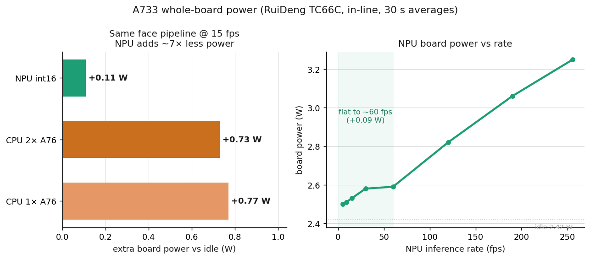

# MediaPipe FaceLandmarker on the VeriSilicon VIP9000 NPU (Allwinner A733)

A self-contained port of Google's MediaPipe FaceLandmarker (face detection, a
478 point 3D face mesh, and 52 blendshapes) to the VeriSilicon VIP9000 NPU found
on the Allwinner A733. It runs on the 3 TOPS NPU of the Radxa Cubie A7A (and the
A7Z, A7S, Orange Pi 4 Pro). The repository contains the vendored models, the
compiled network binaries, the conversion recipe, the runtime recipe, and the
on-device measurements.


The goal is a working, reproducible recipe with honest, measured numbers. If
something here is unclear or you spot a mistake, please open an issue.

## Use it

On the board (Radxa Cubie A7A or any A733 with `/dev/vipcore`), after the
one-time runtime install of [benchmark/RUNTIME.md](benchmark/RUNTIME.md):

```bash
git clone https://github.com/arnaudlvq/MediaPipe-FaceLandmarker-NPU-Version-A733-VeriSilicon-VIP9000
cd MediaPipe-FaceLandmarker-NPU-Version-A733-VeriSilicon-VIP9000/runner
make && ./fl_run --models ../compiled --ppm face.ppm --loop 100
```

That is the whole pipeline on the NPU: image in, 478 landmarks + 52 blendshapes
out, as JSON, with latency percentiles. Validated on the board: **16.2 ms per
frame** end to end (vs 32.4 ms for MediaPipe CPU on the same board), and the
landmarks agree with the official MediaPipe output to **0.58 px mean**. `make`
also produces `libfacelandmarker_npu.so`, a three-function C API usable from
Python via ctypes. Details, measured numbers, and the API:
[runner/README.md](runner/README.md).

To benchmark a single model in isolation (no pre/post), use `vpm_run` as in
[benchmark/RUNTIME.md](benchmark/RUNTIME.md). To redo the model conversion from
scratch, the models are vendored in `models/` and the exact `pegasus` commands
are in [convert/README.md](convert/README.md).

## Results

All numbers were measured on a Radxa Cubie A7A (Allwinner A733, kernel
`5.15.147-21-a733`, `/dev/vipcore`, ai-sdk VIPLite v2.0). The NPU figures come
from the `vpm_run` tool, averaged over 100 loops. The CPU figures use the raw
per-model TFLite inference (tflite-runtime, XNNPACK, median of 100 loops, pinned
to a Cortex-A76). Both sides measure pure inference, so the comparison is at the
same scope.

### Latency


| model | NPU int16 | CPU fp32 (1x A76) | CPU fp32 (2x A76) | NPU fp16 |
|---|--:|--:|--:|--:|
| face_detector | 0.67 ms | 3.86 ms | 2.39 ms | 21.8 ms |
| face_landmarks | 3.16 ms | 17.75 ms | 12.84 ms | 98.1 ms |
| face_blendshapes | 0.48 ms | 2.63 ms | 1.71 ms | 14.6 ms |
| 3-model total | **4.31 ms** | 24.2 ms | 16.9 ms | 134 ms |

INT16 on the NPU runs the three models in 4.31 ms. That is 5.6 times faster than
one Cortex-A76 core and 3.9 times faster than both, at matched output accuracy
(the INT16 mesh is 0.12 px from the fp32 reference). Against MediaPipe's full CPU
frame, which also does letterboxing, anchor decoding, NMS, and cropping, the
end-to-end gap is about 8 times. The two scopes are reported separately on
purpose.

### Precision: INT16 is the one to deploy

We converted the models at every precision the toolchain offers and measured
each against the reference TFLite output on identical inputs.


| precision | landmark error vs reference | verdict |
|---|--:|---|
| FP16 | 0.09 px | accurate, but slow on this NPU (see below) |
| **INT16** | **0.12 px** | **accurate and fast: the one to deploy** |
| INT8 (per-channel) | 1.78 px | too lossy, rejected |
| BF16 | not measurable | rejected by the hardware (see below) |

FP16 and INT16 are both near lossless. INT8 breaks the detector and landmark
heads. The choice between FP16 and INT16 is therefore decided by speed on the
silicon, not by accuracy.

FP16 is a trap on this chip. The FP16 landmarks graph executes 98.4 million
cycles per inference against 3.4 million for INT16, a factor of 29, at the same
effective clock near 1 GHz. The reason is architectural: the NANO-DI's fast MAC
arrays are integer only, so FP16 convolutions fall back to a slow programmable
path. No export flag changes this. On a larger VIP9000 with a real FP16 pipeline
the result would differ, but on this chip FP16 is slower than the CPU. We
confirmed this with hardware cycle counters rather than inferring it.

BF16 quantizes correctly in software but the NBG export is rejected by the
NANO-DI capability check (`VX_ERROR_NOT_SUPPORTED`), reproduced on three models.
The chip does not accept BF16 tensors.

Cycle counts and method: [benchmark/results/latency.json](benchmark/results/latency.json).

### Energy

Power was measured on the whole board with an in-line RuiDeng TC66C USB meter
(30 second averages, CPU utilisation tracked to confirm the draw is the NPU's).



Running the three-model pipeline at 15 fps, the NPU adds 0.11 W over the 2.42 W
idle, against 0.77 W for one Cortex-A76. That is about 7 times less power for the
same result. The NPU's board power stays nearly flat from 5 to 60 fps (2.50 W to
2.59 W), so the inference rate can be raised with almost no energy cost up to
about 60 fps. During NPU inference the A76 stays at 1 to 3 percent utilisation,
which confirms the measured watts are the NPU's and not hidden CPU work.

Raw numbers: [benchmark/results/power.json](benchmark/results/power.json).

## How it works

The FaceLandmarker is three models chained through the VIPLite runtime, each
compiled to an NBG (VeriSilicon network binary graph):

```
camera frame  ->  face_detector (BlazeFace, 128x128)  ->  896 anchors
              ->  face_landmarks_detector (Attention Mesh, 256x256)  ->  478 points
              ->  face_blendshapes (MLP-Mixer, 146 points)  ->  52 scores
```

Three details took most of the work:

1. The `float16` quantizer in ACUITY 6.30.22 makes the conversion lossless, but
   `int16` is what you deploy: it is about 30 times faster on the NANO-DI for
   near-identical accuracy.
2. The NPU target for the A733 is `VIP9000NANODI_PID0X1000003B`.
3. The blendshapes model takes a 146-landmark subset, extracted from MediaPipe's
   `face_blendshapes_graph.cc` ([convert/landmarks_subset.py](convert/landmarks_subset.py)).

The CPU glue between the three models (letterbox, anchor decoding, face crop,
landmark subset) is implemented in [runner/](runner/), a small dependency-free
C program. Full conversion recipe: [convert/README.md](convert/README.md).

## Repository layout

```
runner/      the chained C runner: image -> landmarks + blendshapes, one call
models/      the source MediaPipe models, vendored (face_landmarker.task + 3 TFLite)
compiled/    6 NBG binaries (fp16 and int16) plus the generated OpenVX C projects
convert/     the reproducible ACUITY pipeline and the numeric validation script
benchmark/   RUNTIME.md (run the NBG) and cpu_permodel_bench.py (the CPU baseline)
             results/  measured latency.json, fidelity.json, power.json
charts/      the chart generator (run after a benchmark to refresh the PNGs)
docs/        RESEARCH.md, the survey of the toolchain landscape behind this work
```

The repository is self-contained: the models are vendored and the NBG are
committed, so it keeps working even if the upstream MediaPipe download or the
ai-sdk mirror move. The two proprietary VeriSilicon pieces cannot be vendored, so
they are pinned by exact version instead. Conversion uses the ACUITY docker image
`ubuntu-npu:v2.0.10.2`. Runtime uses ai-sdk VIPLite v2.0 (`libNBGlinker.so`,
`libVIPhal.so`) and the `/dev/vipcore` driver from the A733 BSP.

## Intended use and limits

This repository provides the models, the compiled binaries, and the recipe. It
is application-agnostic: you use these models in whatever you are building. What
it does not yet include is a single chained C runner that does the CPU
pre-processing and post-processing (letterbox, anchor decode, NMS, crop) around
the three NBG. That runner is the next step. The compiled NBG are specific to
this NPU target; another VIP9000 variant needs a re-export with the matching
`--optimize` target.

## Topics

`mediapipe` `npu` `verisilicon` `vip9000` `allwinner` `a733` `radxa` `edge-ai`
`face-landmarks` `face-mesh` `blazeface` `tflite` `acuity` `quantization`
`edge-inference` `single-board-computer`

## License

MIT (see [LICENSE](LICENSE)) for this project's own code, scripts, and build
recipes. The compiled binaries in `compiled/` are derivatives of Google's
MediaPipe FaceLandmarker models and remain under their original Apache-2.0
terms; see [NOTICE](NOTICE) for the third-party attribution. This is an
independent project, not affiliated with Google, VeriSilicon, Allwinner, or
Radxa.
