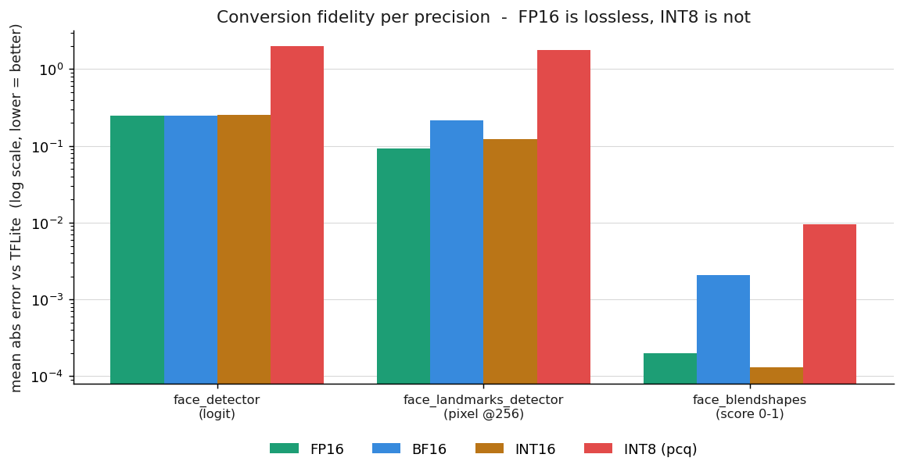
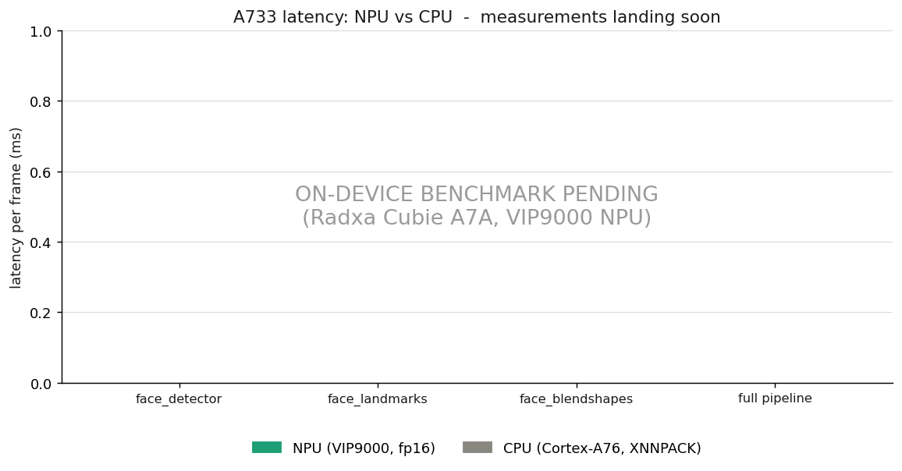

# MediaPipe FaceLandmarker on the VeriSilicon VIP9000 NPU (Allwinner A733)

**The first public port of Google's MediaPipe FaceLandmarker to a VeriSilicon
VIP9000 NPU** — face detection, 478-point face mesh, and 52 blendshapes,
compiled to run on the 3 TOPS NPU of the Allwinner A733 (Radxa Cubie A7A / A7Z
/ A7S, Orange Pi 4 Pro).


---

## Why this exists

Nobody had published it. A [survey of the toolchain landscape](docs/RESEARCH.md)
(19 sources, adversarially fact-checked) confirmed that no public port of
MediaPipe's face models to a VIP9000-class NPU existed — Radxa's own model zoo
for the A7A ships ~20 models, **none of them MediaPipe**. There are open
requests for exactly this capability ([onnxruntime#28244](https://github.com/microsoft/onnxruntime/issues/28244),
[Frigate#23418](https://github.com/blakeblackshear/frigate/discussions/23418)).

If you have an A733 board and want face landmarks / mesh / blendshapes off the
CPU and onto the NPU, this repo is your starting point: the **conversion
recipe**, the **compiled NBG binaries**, the **fidelity validation**, and a
**benchmark harness**.

## Status

| Stage | State |
|---|---|
| Extract the 3 TFLite models from `face_landmarker.task` | ✅ done |
| Import into ACUITY (BlazeFace, Attention Mesh, Blendshapes) | ✅ 0 errors |
| Quantize (fp16 / bf16 / int16 / int8-pcq) | ✅ done |
| Export to NBG for the exact A733 NPU target | ✅ 0 errors |
| Numerically validate vs reference TFLite | ✅ FP16 lossless |
| Generate the OpenVX C runner projects | ✅ done |
| **Run on the physical NPU + latency/thermal benchmark** | ⏳ **landing soon** |

This is an honest snapshot: **the conversion half is complete and validated;
the on-device execution half is in progress.** The compiled binaries target
the VIP9000 but have not yet been clocked on silicon — those numbers, and a
live demo, are the next drop.

## Results

### Conversion fidelity (measured)

Every converted model was compared against the reference TFLite/XNNPACK output
on identical inputs. **FP16 is lossless** (the MediaPipe models ship as
float16, and the VIP9000 runs FP16 natively), while naive INT8 wrecks the
landmark and detector heads — exactly the trade-off this chart makes visible:



Headline numbers (mean abs error vs TFLite):

| model | output | FP16 | INT16 | INT8 (pcq) |
|---|---|---|---|---|
| face_detector | box logits | **0.25** | 0.25 | 1.97 ❌ |
| face_landmarks | 478 pts (px) | **0.09 px** | 0.12 px | 1.78 px ❌ |
| face_blendshapes | 52 scores | **0.0002** | 0.0001 | 0.0095 |

**Recommended path: FP16 everywhere.** INT16 is compiled as a speed
alternative; INT8 is rejected.

### On-device latency: NPU vs CPU (pending)



## How it works

```
camera frame
   │
   ▼  128×128            ▼  256×256 (face crop)        ▼  146 landmarks (px)
┌──────────────┐   ┌───────────────────────┐   ┌────────────────────┐
│ face_detector│──▶│ face_landmarks_detector│──▶│  face_blendshapes  │
│  (BlazeFace) │   │   (Attention Mesh)     │   │   (MLP-Mixer)      │
└──────────────┘   └───────────────────────┘   └────────────────────┘
   896 anchors          478 × 3D points              52 scores (eyeLook*, …)
```

All three are compiled to **NBG** (VeriSilicon network binary graph) and chained
through the VIPLite runtime. The non-obvious bits that took digging:

- The **`float16` quantizer** in ACUITY 6.30.22 (undocumented by Radxa) makes
  the conversion lossless — no INT8 calibration headaches.
- The **NPU target** for the A733 is `VIP9000NANODI_PID0X1000003B`.
- The **146-landmark subset** fed to the blendshapes model, extracted from
  MediaPipe's `face_blendshapes_graph.cc` ([convert/landmarks_subset.py](convert/landmarks_subset.py)).

Full recipe: [convert/README.md](convert/README.md).

## Repository layout

```
compiled/    6 NBG binaries (fp16 + int16) + generated OpenVX C projects
convert/     reproducible ACUITY pipeline + numeric validation script
benchmark/   latency / thermal / throttle harness (peak + 2-hour endurance)
charts/      chart generator (run after a benchmark to refresh the PNGs)
docs/        RESEARCH.md — the state-of-the-art survey behind this work
```

## Reproduce

You need the Allwinner ACUITY docker image (`ubuntu-npu:v2.0.10.2`) for the
A733; see [convert/README.md](convert/README.md) for the exact `pegasus`
commands. In short:

```bash
./fetch_models.sh                       # download + extract the 3 TFLite models
python convert/prepare_workspaces.py    # build calibration workspaces
# ... pegasus import → quantize float16 → export ovxlib  (see convert/README.md)
python charts/make_charts.py            # refresh charts from benchmark/results/
```

## Hardware

Any **Allwinner A733** board (VeriSilicon VIP9000, 3 TOPS INT8, FP16/BF16/INT16
native): Radxa Cubie **A7A / A7Z / A7S**, Orange Pi 4 Pro. The compiled NBG are
target-specific to this NPU; other VIP9000 variants need a re-export with the
matching `--optimize` target.

## Roadmap

- [ ] First on-device inference (compile the generated C against VIPLite)
- [ ] Latency + thermal benchmark, NPU vs CPU, peak & 2-hour endurance
- [ ] Full C runner: anchor decoding, NMS, crop, the 3-model chain
- [ ] Live demo (the [Watch Me](https://github.com/arnaudlvq/watchme) eye-contact clock that motivated this)
- [ ] Python path via `tflite-vx-delegate` (exploratory, see RESEARCH.md)

## Topics

`mediapipe` · `npu` · `verisilicon` · `vip9000` · `allwinner` · `a733` ·
`radxa` · `edge-ai` · `face-landmarks` · `face-mesh` · `blazeface` · `tflite` ·
`acuity` · `quantization` · `edge-inference` · `single-board-computer`

## License & attribution

Apache-2.0 (see [LICENSE](LICENSE) and [NOTICE](NOTICE)). The compiled binaries
are derivatives of Google's MediaPipe FaceLandmarker models, distributed under
Apache-2.0. This is an independent project, not affiliated with Google,
VeriSilicon, Allwinner, or Radxa.
